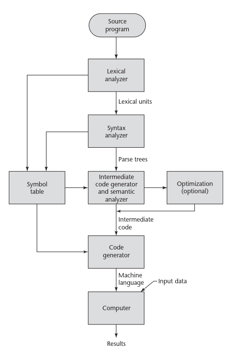

<div align="center">    
    <p style="font-size: 12pt; line-height: 0.5; font-family: 'Times New Roman', serif;">Universidade Federal do Rio Grande do Norte</p>
    <p style="font-size: 12pt; line-height: 0.5; font-family: 'Times New Roman', serif;">Departamento de Informática e Matemática Aplicada</p>
    <p style="font-size: 12pt; line-height: 0.5; font-family: 'Times New Roman', serif;">DIM0548 – Engenharia de Linguagens</p>
</div>

<div style="margin-top: 25vh;"></div>

<div align="center">
    <h1 style="font-family: 'Times New Roman', serif;">DOCUMENTAÇÃO</h1>
    <h2 style="font-family: 'Times New Roman', serif;">KOJITO</h2>
</div>

<div style="margin-top: 15vh;"></div>

<div align="right">
    <p style="font-size: 12pt; line-height: 0.5; font-family: 'Times New Roman', serif;">EXPEDITO HEBERT FIRMINO DA ROCHA</p>
    <p style="font-size: 12pt; line-height: 0.5; font-family: 'Times New Roman', serif;">FRANCISCO GABRIEL COSTA BESSA</p>
    <p style="font-size: 12pt; line-height: 0.5; font-family: 'Times New Roman', serif;">JOSE CARLOS DA SILVA NASCIMENTO</p>
    <p style="font-size: 12pt; line-height: 0.5; font-family: 'Times New Roman', serif;">PEDRO VINÍCIUS BARBOSA PEREIRA</p>
    <p style="font-size: 12pt; line-height: 0.5; font-family: 'Times New Roman', serif;">SABRINA DA SILVA BARBOSA VENCESLAU</p>
</div>

<div style="margin-top: 25vh;"></div>

<div align="center" style="position: bottom;">
    <p style="font-size: 12pt; line-height: 0.5; font-family: 'Times New Roman', serif;">Natal - RN</p>
    <p style="font-size: 12pt; line-height: 0.5; font-family: 'Times New Roman', serif;">2026</p>
</div>


<div style="page-break-after: always;"></div>

<div style="font-size: 12pt; line-height: 1.5; font-family: 'Times New Roman', serif; padding: 20px;">
    <div align="center" style="margin-bottom: 40px;">
        <p style="font-size: 12pt; line-height: 0.5; font-family: 'Times New Roman', serif;">SUMÁRIO</p>
    </div>
    <div style="display: flex; flex-direction: column; gap: 10px;">
        <div style="display: flex; justify-content: space-between; align-items: flex-end;">
            <span>
                <a href="#APRESENTACAO" style="text-decoration: none; color: black;">
                    <strong>1. APRESENTAÇÃO DA LINGUAGEM PROPOSTA</strong>
                </a>
            </span>
            <span style="flex-grow: 1; border-bottom: 1px dotted #000000; margin: 0 10px; position: relative; top: -4px "></span>
            <span><strong>3</strong></span>
        </div>
        <div style="display: flex; justify-content: space-between; align-items: flex-end;">
            <span>
                <a href="#DESIGN" style="text-decoration: none; color: black;">
                    <strong>2. DESIGN DA IMPLEMENTAÇÃO</strong>
                </a>
            </span>
            <span style="flex-grow: 1; border-bottom: 1px dotted #000000; margin: 0 10px; position: relative; top: -4px;"></span>
            <span><strong>4</strong></span>
        </div>
        <div style="display: flex; justify-content: space-between; align-items: flex-end; padding-left: 20px;">
            <span>
                <a href="#Transformação" style="text-decoration: none; color: black;">
                    2.1 Transformação do código-fonte em unidades léxicas
                </a>
            </span>
            <span style="flex-grow: 1; border-bottom: 1px dotted #000000; margin: 0 10px; position: relative; top: -4px;"></span>
            <span>4</span>
        </div>
        <div style="display: flex; justify-content: space-between; align-items: flex-end; padding-left: 20px;">
            <span>
                <a href="#Representação" style="text-decoration: none; color: black;">
                    2.2 Representação de símbolos, tabela de símbolos e funções associadas
                </a>
            </span>
            <span style="flex-grow: 1; border-bottom: 1px dotted #000000; margin: 0 10px; position: relative; top: -4px;"></span>
            <span>7</span>
        </div>
        <div style="display: flex; justify-content: space-between; align-items: flex-end; padding-left: 20px;">
            <span>
                <a href="#Tratamento" style="text-decoration: none; color: black;">
                    2.3 Tratamento de estruturas condicionais e de repetição
                </a>
            </span>
            <span style="flex-grow: 1; border-bottom: 1px dotted #000000; margin: 0 10px; position: relative; top: -4px;"></span>
            <span>7</span>
        </div>
        <div style="display: flex; justify-content: space-between; align-items: flex-end; padding-left: 20px;">
            <span>
                <a href="#Tratamento de subprogramas" style="text-decoration: none; color: black;">
                    2.4 Tratamento de subprogramas
                </a>
            </span>
            <span style="flex-grow: 1; border-bottom: 1px dotted #000000; margin: 0 10px; position: relative; top: -4px;"></span>
            <span>9</span>
        </div>
        <div style="display: flex; justify-content: space-between; align-items: flex-end; padding-left: 20px;">
            <span>
                <a href="#Verificações realizadas" style="text-decoration: none; color: black;">
                    2.5 Verificações realizadas (tipos, faixas, declaração em duplicidade, etc)
                </a>
            </span>
            <span style="flex-grow: 1; border-bottom: 1px dotted #000000; margin: 0 10px; position: relative; top: -4px;"></span>
            <span>10</span>
        </div>
        <div style="display: flex; justify-content: space-between; align-items: flex-end;">
            <span>
                <a href="#INSTRUÇÕES" style="text-decoration: none; color: black;">
                    <strong>3. INSTRUÇÕES DE USO DO COMPILADOR</strong>
                </a>
            </span>
            <span style="flex-grow: 1; border-bottom: 1px dotted #000000; margin: 0 10px; position: relative; top: -4px;"></span>
            <span><strong>10</strong></span>
        </div>
    </div>
</div>

<div style="page-break-after: always;"></div>

<div style="font-size: 12pt; line-height: 1.5; font-family: 'Times New Roman', serif; text-align: justify;">
    <h1 id="APRESENTACAO" style="font-size: 12pt; font-family: 'Times New Roman', serif; margin-bottom: 24px; text-transform: uppercase;"> 1. APRESENTAÇÃO DA LINGUAGEM PROPOSTA </h1>
    <p style="text-indent: 50px; margin-bottom: 12px;">
        O presente trabalho tem como objetivo apresentar a linguagem de programação Kojito, que está sendo desenvolvida como parte dos requisitos para concluir a disciplina de Engenharia de Linguagem do Departamento de Informática e Matemática Aplicada/DIMAP na Universidade Federal do Rio Grande do Norte/UFRN.
    </p>
    <p style="text-indent: 50px; margin-bottom: 12px;">
        Para tanto, a Kojito consiste em ser uma linguagem de programação com paradigma imperativo que se fundamenta na arquitetura de von Neumann e adota um estilo de programação com uso de variáveis, instruções de atribuição e na forma iterativa de repetição. De modo geral, caracteriza-se pela forma de comandos detalhados para a realização de uma determinada tarefa.
    </p>
    <p style="text-indent: 50px; margin-bottom: 12px;">
        Também é importante salientar que o domínio de aplicação da nossa linguagem é de uma Linguagem educacional, com foco no ensino de aspectos relacionados à segurança de memória, bem como aspectos que vêm do funcional. 
        Nossa ideia se aplica principalmente a alunos que já tiveram algum contato com programação, especialmente quem já teve algum contato com programação no nível do que é visto, por exemplo, na disciplina de Linguagem de Programação 1, ofertada pelo Instituto Metrópole Digital/IMD no curso do Bacharelado em Tecnlogia da Informação BTI.
        Dessa forma, o objetivo é dar um suporte no aprendizado sobre coisas básicas, porém importantes para um bom uso dos recursos computacionais, ressaltando os trade offs relacionados ao uso de memória e os custos ao utilizar recursos de alto nível.
    </p>
    <p style="text-indent: 50px; margin-bottom: 12px;">
        Salienta-se ainda que a Kojito está no âmbito de software básico educacional e, baseando-se no livro concepts of programming Languages edição 11 de Robert W. Sebesta, os critérios que têm maior relevância para a nossa linguagem são, principalmente, a legibilidade e a confiabilidade. 
        Destacando que algumas características presentes em capacidade de escrita, como o tipo de dados, ortogonalidade e suporte à abstrações, por exemplo, têm um papel fundamental para a construção da nossa linguagem, pois essas características somadas a checagem de tipo, tratamento de exceção e restricted aliasing, fornecem uma estrutura robusta para ela. 
        Todavia, apesar de não ser uma linguagem com foco em alta performance, algumas características relacionadas ao custo se fazem necessárias para se ter um equilíbrio entre o uso de recursos disponíveis (baixo nível) e a contribuição ao aprendizado do usuário (alto nível). Entretanto, caso necessário, essas características de custo serão as primeiras a serem penalizadas em prol de uma maior confiabilidade e/ou legibilidade.
    </p>
    <p style="text-indent: 50px; margin-bottom: 12px;">
        Por fim, cabe destacar que para desenvolver a linguagem de programação Kojito, não será necessário criar uma nova camada de abstração, sendo possível usufruir das características do paradigma imperativo e ainda deixá-la num nível intermediário entre alto nível e baixo nível.
        Portanto, nossa ideia consiste em uma linguagem mais segura, tendo foco em legibilidade e confiabilidade, sacrificando aspectos, principalmente, relacionados ao custo se preciso for.
    </p>
</div>

<div style="page-break-after: always;"></div>

<div style="font-size: 12pt; line-height: 1.5; font-family: 'Times New Roman', serif; text-align: justify;">
    <h1 id="DESIGN" style="font-size: 12pt; font-family: 'Times New Roman', serif; margin-bottom: 24px; text-transform: uppercase;"> 2 DESIGN DA IMPLEMENTAÇÃO </h1>
    <p style="text-indent: 50px; margin-bottom: 12px;">
        Para a concretização de nossa ideia seguimos as instruções norteadoras dadas pelo professor Dr. Umberto Souza da Costa, bem como baseamo-nos no fluxo presente no livro do Sebesta - Concepts of programming Languages edição 11, que apresenta o processo de compilação. Dessa forma, iniciamos a nossa linguagem definindo o que seria um programa nela em que, a partir disso, construimos os nossos tokens para gerar a nossa tabela de símbolos, para então gerar as estruturas sintáticas da mesma e, por fim, poder realizar as relações de sentindo entre as estruturas sintáticas, bem como as relações de tipos, conforme imagem abaixo:
    </p>
    <div align="center" style="margin: 24px 0; font-family: Arial, sans-serif; font-size: 10pt;">
        <p style="margin-bottom: 8px;"><strong>Figura 1</strong> – Processo de compilação</p>
        
        <p style="margin-top: 8px; font-size: 10pt; color: #8f8f8f;">Fonte: Robert W. Sebesta (2015).</p>
    </div>
    <p style="text-indent: 50px; margin-bottom: 12px;">
        Com isso, entraremos em detalhes a seguir, de modo que traremos exemplos de como ocorre em nossa linguagem, apresentando quais foram as estratégias que utilizamos para a realização desses passos.
    </p>
</div>

<div style="font-size: 12pt; line-height: 1.5; font-family: 'Times New Roman', serif; text-align: justify;">
    <p id="Transformação" style="text-indent: 50px; margin-bottom: 12px;">
        <h3> 2.1 Transformação do código-fonte em unidades léxicas</h3>
    </p>
    <p style="text-indent: 50px; margin-bottom: 12px;">
        Para que um código em linguagem imperativa seja lido e executado é importante lembrar que ele passa por 3 grandes etapas que são popularmente conhecidas por: Analisador lexico; Analisador Sintático e Analisador Semântico, além de passar por outros processos menores como podemos ver na figura 1.
    </p>
    <p style="text-indent: 50px; margin-bottom: 12px;">
        Isso posto, de acordo com Andrew W. Appel (1998), o analisador léxico recebe um fluxo de caracteres e produz um fluxo de nomes, palavras-chaves e sinais de pontuação (lexemas), descartando espaços em branco e comentários entre os tokens. Porém, cabe destacar que a depender do design da linguagem, pode acontecer de espaços em branco serem na verdade tokens, não podendo descartá-los. 
        Complementar a isso, de acordo com Sebesta (2015), um analisador léxico é essencialmente um “pattern matcher”, ou seja, é algo que realiza casamento de padrões. 
    <p style="text-indent: 50px; margin-bottom: 12px;">    
        Dessa forma, para uma dada entrada são realizadas comparações com os símbolos existentes na linguagem, de modo que a partir dessas comparações os tokens serão associados ao conjunto de caracteres detectado.
        Dito isso, as principais tarefas de um analisador léxico são:
    </p>
        <ul style="padding-left: 50px; margin-bottom: 12px;">
            <li style="margin-bottom: 6px;">Ler (escanear) todos os caracteres de um dado arquivo (fluxo de entrada);</li>
            <li style="margin-bottom: 6px;">Identificar lexemas (agrupamento de símbolos conhecidos) a partir dos caracteres lidos;</li>
            <li style="margin-bottom: 6px;">Gerar tokens (unidade gramatical de uma linguagem) a partir dos lexemas;</li>
            <li style="margin-bottom: 6px;">Ignorar o que é considerado desnecessário;</li>
            <li style="margin-bottom: 6px;">Gerar a tabela de símbolos para o fluxo de entrada dado;</li>
            <li style="margin-bottom: 6px;">Detectar caracteres não reconhecidos e comunicar erro de símbolo que não faz parte do conjunto de símbolos aceitos pela linguagem.</li>
        </ul>
    </p>
    <p style="text-indent: 50px; margin-bottom: 12px;">
        Assim, realizadas essas tarefas e não havendo nenhum erro lexical, será possível avançar para a etapa de análise sintática, da qual depende essencialmente do que o analisador léxico produz.
    </p>
    <p style="text-indent: 50px; margin-bottom: 12px;">
        Na nossa linguagem, utilizamos regras sintáticas para as quais se torna possível o diálogo com a tabela de símbolos. Cada token possui uma estrutura que o define, sendo possível identificar como devem ser utilizados na linguagem.
    </p>
    <p style="text-indent: 50px; margin-bottom: 12px;">
        Inicialmente, definimos o que é um programa em nossa linguagem. Para isso, utilizamos a regra sintática "Program" como o ponto de partida do compilador. Nesse sentido, é nesta regra inicial que são colocadas as bibliotecas de C que utilizamos (stdio.h e stdbool.h), dado que nossa linguagem está sendo traduzida para C simplificado. Nessa estrutura, o "$1" refere-se ao bloco geral de declarações (Decls) e entrega o seu atributo "code" (um ponteiro de char contendo todo o código traduzido do programa) para ser escrito diretamente no arquivo de saída através da função fprintf.
    </p>
</p>

```bash
Program:
    Decls {
        fprintf(yyout,"#include<stdio.h>\n#include<stdbool.h>\n%s", $1->code);
    }
    ;

Decls: SubProgram Decls{
                        char* temp[] = {$1->code, "\n", $2->code};
                        $$ = CreateRecord(cat(temp,3));
        }
        | Assignment Decls{
                        char* temp[] = {$1->code, "\n", $2->code};
                        $$ = CreateRecord(cat(temp,3));
        }
        | StructDecl Decls{
                        char* temp[]={$1->code, "\n", $2->code};
                        $$ = CreateRecord(cat(temp,3));
        }
        | EnumDecl Decls{
                        char* temp[] = {$1->code, "\n", $2->code};
                        $$ = CreateRecord(cat(temp,3));
        }	
        | Main {
                $$=CreateRecord($1->code);
        }
        ;
```
<div style="font-size: 12pt; line-height: 1.5; font-family: 'Times New Roman', serif; text-align: justify;">
    <p style="text-indent: 50px; margin-bottom: 12px;">
        Com isso, é perceptível que, para nossa linguagem, um programa é definido por declarações e essas declarações podem ser dadas a partir de subprogramas, atribuições (<i>assignments</i>), <i>structs</i>, <i>enums</i> e pela própria <i>main</i>.
    </p>
    <p style="text-indent: 50px; margin-bottom: 12px;">
        Além disso, ao olhar para a regra de Decls se define por meio de uma estrutura recursiva à direita. Para cada uma das opções (como "SubProgram Decls" ou "Assignment Decls"), as informações do elemento atual da declaração ficam guardadas em $1, enquanto o restante das declarações seguintes fica em $2. Os códigos gerados por essas duas partes são concatenados e mandados para o símbolo de retorno $$ (que representa o próprio Decls). 
    </p>
    <p style="text-indent: 50px; margin-bottom: 12px;">
        Dessa forma, o $2 funciona como o laço recursivo que varre as demais instruções do código-fonte, enquanto o $1 alterna conforme o tipo de comando que o programador está declarando naquela linha. Salienta-se ainda que, para algumas regras, há um maior detalhamento à medida em que se tornam mais complexas, como por exemplo a regra do escopo:
    </p>
</div>

```bash
Scope: '{' { PushScope(scopeStack, GenerateScope()); } '}' { 
        $$ = CreateRecord("{}"); PopScope(scopeStack); 
     }
	 | '{' { PushScope(scopeStack, GenerateScope()); } Statements '}' {
        char* temp[] = {"{\n\t",$3->code,"\n}"};
        $$ = CreateRecord(cat(temp,3));
        $$->returnType=$3->returnType;
        PopScope(scopeStack);
     }
```
<div style="font-size: 12pt; line-height: 1.5; font-family: 'Times New Roman', serif; text-align: justify;">
    <p style="text-indent: 50px; margin-bottom: 12px;">
        Nesse sentido, o escopo (<i>Scope</i>) tem sua estrutura definida como chaves (<i>{}</i>) podendo estar vazio ou conter um bloco de comandos internos (<i>{ statments }</i>). Cabe destacar ainda que as ações semânticas referentes à pilha de escopos (<i>scopeStack</i>) são utilizadas principalmente para gerenciar o tempo de vida e a visibilidade das variáveis. Ao empilhar um novo escopo com PushScope ao abrir as chaves e desempilhá-lo com PopScope ao fechá-las, o compilador evita o acesso indevido a informações que pertencem a contextos distintos.
    </p>
    <p style="text-indent: 50px; margin-bottom: 12px;">
        Em geral, as regras definidas no <i>parser</i> seguem esse processo padrão de concatenar as informações de forma semelhante. Todavia, elas possuem particularidades características que exigem uma maior atenção, como foi mostrado. Desde que o registro esteja sendo gerado corretamente, o compilador será capaz de avaliar o fluxo de entrada feito na nossa linguagem, realizar o casamento de padrões e identificar erros sintáticos ou semânticos, caso existam.
    </p>
</div>

<div style="font-size: 12pt; line-height: 1.5; font-family: 'Times New Roman', serif; text-align: justify;">
    <p id="Representação" style="text-indent: 50px; margin-bottom: 12px;">
        <h3> 2.2 Representação de símbolos, tabela de símbolos e funções associadas</h3>
    </p>
    <p style="text-indent: 50px; margin-bottom: 12px;">
        Para a tabela de símbolos, foi feita uma tabela hash. Através das funções <i>create_table, hash, insert_symbol, lookup_symbol</i> torna-se possível registrar todas as informações necessárias para serem consultadas durante a compilação de um programa na nossa linguagem. Dessa forma, além das regras sintáticas, há também a tradução das estruturas da nossa linguagem para as estruturas de C simplificado, utilizando o GCC para gerar o executável final. Um exemplo prático do uso da tabela hash pode ser visualizado abaixo na regra de acesso a arrays:
    </p>
</div>

```bash
Array: ID ArrayAccesses {
			type typeArrayAcess = getVarType($1);
			for(int i = 0; i < $2->sizeOfArrayAcess; i++){
				type arrayStore = lookup_symbol(typeTable, typeArrayAcess)->info->isArray;
				if(arrayStore != NULL){
					typeArrayAcess = arrayStore;
				}
			}
			char temp[] = {$1, $2->code};
			$$ = CreateRecordType(cat(temp,2), typeArrayAcess);
	 }
     ;
```
<div style="font-size: 12pt; line-height: 1.5; font-family: 'Times New Roman', serif; text-align: justify;">
    <p style="text-indent: 50px; margin-bottom: 12px;">
        No trecho acima, a função de busca <i>lookup_symbol</i> é utilizada na tabela de tipos para resolver as dimensões do array a cada nível de acesso. Nesse sentido, são passados para essa função a tabela e o tipo atual da variável, permitindo atualizar a variável <i>typeArrayAcess</i> com o tipo interno do array, que é temporariamente atribuído a <i>arrayStore</i>. Ao final do loop, garante-se que o tipo resultante corresponda ao dado que está sendo efetivamente acessado, seja ele um tipo base ou um ponteiro compatível, permitindo a criação correta do registro na árvore sintática.
    </p>
    <p style="text-indent: 50px; margin-bottom: 12px;">
        Para as funções de inserção, criação de tabela e criação do hash, foram distribuídas em arquivos distintos para modularizar o projeto e facilitar a leitura do <i>parser</i>. Todavia, existe uma total integração entre esses arquivos, permitindo que o registro e a consulta na tabela de símbolos sejam realizados com sucesso, desde que o fluxo de entrada esteja coerente com as regras estabelecidas para a linguagem Kojito.
    </p>
</div>

<div style="font-size: 12pt; line-height: 1.5; font-family: 'Times New Roman', serif; text-align: justify;">
    <p id="Tratamento" style="text-indent: 50px; margin-bottom: 12px;">
        <h3> 2.3 Tratamento de estruturas condicionais e de repetição</h3>
    </p>
    <p style="text-indent: 50px; margin-bottom: 12px;">
        Em relação às estruturas condicionais temos o If e as comparações que fazem parte da estrutura (<i>==, !=, >, <, >=, <=</i>). Dessa forma, para melhor entender como funciona o if em nossa linguagem, abaixo há um exemplo de um if simples:
    </p>
</div>

```bash
DecisionStructures: IF '(' Expression ')' Scope {
						char* counter = ifCount();
						char* tempif[] = {"IF_SCOPE", counter};
						char* tempend[] = {"ENDIF_", counter};
						char* ifScope = cat(tempif, 2);
						char* endIf = cat(tempend, 2);
						char* temp[] = {
							"\nif", "(", $3->code, ")", " goto ", ifScope, ";\n", 
							"\ngoto ", endIf, ";\n", 
							ifScope, ":\n", $5->code, "\n",
							endIf, ": "
				  };
                  $$ = CreateRecord(cat(temp, 16));
                  }
```
<div style="font-size: 12pt; line-height: 1.5; font-family: 'Times New Roman', serif; text-align: justify;">
    <p style="text-indent: 50px; margin-bottom: 12px;">
        Nesse sentido, esse trecho indica que o if tem uma estrutura simples: <i>if ( expression ) scope</i> e, logo adiante, se tem como é realizada a tradução dessa estrutura para o C simplificado.
    </p>
    <p style="text-indent: 50px; margin-bottom: 12px;">
        Assim, a função <i>ifCount()</i> gera um contador único para que cada estrutura if no programa tenha seus próprios rótulos (<i>IF_SCOPE</i> para o bloco interno e <i>ENDIF_</i> para o fim do bloco), evitando conflitos entre múltiplos condicionais.
    </p>
     <p style="text-indent: 50px; margin-bottom: 12px;">
        Para o mapeamento do fluxo, se a condição (<i>$3->code</i>) for verdadeira, o programa faz um desvio (<i>goto</i>) para o rótulo do escopo interno (<i>ifScope</i>) e executa o código do bloco (<i>$5->code</i>). Caso contrário, se a condição for falsa, o programa ignora o desvio condicional, encontra o comando <i>goto endIf</i>; e salta diretamente para o final da estrutura, ignorando o corpo do if.
    </p>
    <p style="text-indent: 50px; margin-bottom: 12px;">
        Por fim, o array temp concatena todas essas instruções (a validação da expressão, as instruções de salto e o código do escopo) em uma única string que substitui a regra sintática na árvore de derivação.
    </p>
    <p style="text-indent: 50px; margin-bottom: 12px;">
        Além disso, para as estruturas de repetição temos o exemplo do <i>while</i> que se estrutura da seguinte forma: <i>while ( expression ) scope</i> e sua estrutura em C simplificado é dada conforme regra abaixo:
    </p>
</div>

```bash
RepeatStructures:
        WHILE '(' Expression ')' Scope {
						char* counter = whileCount();
						char* tempw[] = {"WHILE_", counter}; 
						char* tempendw[] = {"ENDWHILE_", counter};
						char* tempWhileScop[] = {"WHILESCOPE_", counter};
						char* whileLabel = cat(tempw, 2); 
						char* endWhile = cat(tempendw, 2);
						char* whileScope = cat(tempWhileScop, 2);
						char* temp[] = {
							"\n", whileLabel, ":\nif(", $3->code, ")", " goto ", whileScope, ";\n", 
							"goto ", endWhile, ";\n", 
							whileScope, ":\n", $5->code, " ",
							"\ngoto ", whileLabel,";\n",
							endWhile, ":"
						}; 
						$$ = CreateRecord(cat(temp, 20)); 
                    }
```
<div style="font-size: 12pt; line-height: 1.5; font-family: 'Times New Roman', serif; text-align: justify;">
    <p style="text-indent: 50px; margin-bottom: 12px;">
        Dessa forma, para o <i>while</i> a tradução é feita de modo que a função <i>whileCount()</i> gera um identificador numérico único para aquele laço, semelhante ao que foi feito para o if. A partir dele, são criados três rótulos específicos usando a função cat:
    </p>
    <ul style="margin-bottom: 12px;">
        <li>whileLabel (WHILE_X): O ponto de início e reavaliação da condição.</li>
        <li>whileScope (WHILESCOPE_X): O início do bloco de código interno do laço.</li>
        <li>endWhile (ENDWHILE_X): O ponto de saída do laço.</li>
    </ul>
    <p style="text-indent: 50px; margin-bottom: 12px;">
        Assim, o array <i>temp</i> organiza a lógica do laço de modo que no <i>whileLabel</i> é avaliada a condição (<i>$3->code</i>). Se for verdadeira, dispara um <i>goto</i> para o corpo do laço (<i>whileScope</i>). Se for falsa, o código segue para a linha seguinte e dispara um <i>goto</i> para fora do laço (<i>endWhile</i>). Em seguida o código interno do <i>whileScope</i> corresponde ao escopo do <i>while</i> (<i>$5->code</i>). Assim, ao final do bloco do escopo, o <i>goto whileLabel;</i> força o programa a voltar para o início para reavaliar a condição, criando o ciclo de repetição.
    </p>
    <p style="text-indent: 50px; margin-bottom: 12px;">
        Por fim, o array temp (com suas 20 strings concatenadas) é processado pela função <i>CreateRecord</i>, salvando a estrutura do <i>while</i> em C simplificado no nó atual da árvore sintática (<i>$$</i>).
    </p>
</div>

<div style="font-size: 12pt; line-height: 1.5; font-family: 'Times New Roman', serif; text-align: justify;">
    <p id="Tratamento de subprogramas" style="text-indent: 50px; margin-bottom: 12px;">
        <h3> 2.4 Tratamento de subprogramas</h3>
    </p>
    <p style="text-indent: 50px; margin-bottom: 12px;">
        A linguagem suporta três construções distintas para subprogramas, diferenciadas por suas palavras-chave e comportamentos semânticos:
        <ul>
            <li> FUNCTION: Declara uma função padrão que recebe parâmetros, possui um tipo de retorno (indicado por ARROW Type) e executa um bloco de código (Scope). A função FUNCTION_Decl gerencia seu registro.</li>
            <li> PURE FUNCTION: Uma variação que identifica funções puras (geralmente indicando que não geram efeitos colaterais e sempre retornam o mesmo valor para os mesmos argumentos). É tratada especificamente por PURE_FUNCTION_Decl.</li>
            <li> PROCEDURE: Declara um procedimento. Diferente das funções, procedimentos não possuem tipo de retorno (ARROW Type), servindo apenas para executar uma sequência de comandos (Scope). É tratado por PROCEDURE_Decl.
        </ul>
    </p>
    <p style="text-indent: 50px; margin-bottom: 12px;">
        A regra Main trata especificamente da função principal do programa. Ela mapeia uma assinatura do tipo FUNCTION MAIN (...) diretamente para a sintaxe padrão do C (int main()), concatenando essa assinatura ao código gerado dentro do seu escopo ($8->code) e gerando o registro final do programa executável.
    </p>
</div>

<div style="font-size: 12pt; line-height: 1.5; font-family: 'Times New Roman', serif; text-align: justify;">
    <p id="Verificações realizadas" style="text-indent: 50px; margin-bottom: 12px;">
        <h3> 2.5 Verificações realizadas</h3>
    </p>
    <p style="text-indent: 50px; margin-bottom: 12px;">
        Para a análise semântica são realizadas verificação de escopo e declaração de variáveis, bem como verificação de compatibilidade de tipos, validação de arrays e tipos complexos, além da geração de código e desvios seguros.
    </p>
    <p style="text-indent: 50px; margin-bottom: 12px;">
        Dessa forma, para a verificação de escopo e declaração de variáveis o compilador gerencia escopos utilizando as funções PushScope e PopScope acionadas pela regra Scope, garantindo que variáveis declaradas dentro de um bloco { ... } não vazem para o escopo externo. De outra forma, na regra IDs (usada em expressões), a função checkVarScope($1) garante que nenhuma variável seja utilizada sem antes ter sido declarada.
    </p>
    <p style="text-indent: 50px; margin-bottom: 12px;">
        Em seguida, para a verificação e compatibilidade de tipos na regra Statements, o compilador valida se múltiplos comandos de retorno (Return) dentro do mesmo bloco possuem tipos compatíveis através da função checkTypeCompat(..., BOTH), de modo que, se houver tipos conflitantes, o compilador interrompe a execução com um erro fatal ("Returns with incompatible types;"). Vale salientar ainda que funções como handleOperandTypes são injetadas em todas as regras de expressões aritméticas e lógicas (OR, AND, NOT_EQUAL, comparações, somas, etc.), permitindo a garantia que os operadores sejam aplicados a operandos válidos e definem o tipo resultante da expressão (como forçar o tipo bool_ após uma comparação). Por fim, a regra SubprogramCall utiliza a função checkParamType($1, $2->paramsTypes). Ela valida se os argumentos passados na chamada da função correspondem em ordem e tipo aos parâmetros esperados pela assinatura da função previamente guardada.
    </p>
    <p style="text-indent: 50px; margin-bottom: 12px;">
        Isso posto, em relação à validação de arrays e tipos complexos, o compilador faz um loop para validar o acesso a índices (ArrayAccesses). Ele busca na tabela de tipos (lookup_symbol na typeTable) para checar se a variável sendo indexada é de fato um array (isArray) e para determinar o tipo final do dado extraído. Além disso, na regra de tipos [ Type ; VALUE_INT ], o compilador gera uma assinatura textual única (ex: [int;5]) e verifica se esse tipo de array já foi registrado. Caso não tenha sido, ele insere dinamicamente na tabela de tipos com a função allocTypeArray.
    </p>
    <p style="text-indent: 50px; margin-bottom: 12px;">
        Por fim, para a geração de código e desvios seguros, embora não seja uma validação puramente estática, o sistema de controle de fluxo de estruturas como IF, ELSE e WHILE gera rótulos numéricos únicos (ifCount(), whileCount()). Isso mitiga erros semânticos na geração do código intermediário (C simplificado), impedindo que desvios (goto) saltem acidentalmente para blocos errados. .
    </p>
</div>

<div style="font-size: 12pt; line-height: 1.5; font-family: 'Times New Roman', serif; text-align: justify;">
    <h1 id="INSTRUÇÕES" style="font-size: 12pt; font-family: 'Times New Roman', serif; margin-bottom: 24px; text-transform: uppercase;"> 3. INSTRUÇÕES DE USO DO COMPILADOR </h1>
    <p style="text-indent: 50px; margin-bottom: 12px;">
        Abaixo seguem as instruções de uso do compilador, para executar e gerar os binários faça:
    </p>
</div>

```bash
# 1. Clone o repositório
git clone https://github.com/BlackbirdBlina/Engenharia-de-Linguagem.git
cd EngenhariaLinguagem

# 2. Instale o Fast Lexical Analyzer Generator (Flex)
sudo apt-get install flex

# 3. Use o makefile para gerar os binários
make

# 4. Execute os binários gerados
make run
```
<div style="font-size: 12pt; line-height: 1.5; font-family: 'Times New Roman', serif; text-align: justify;">
    <p style="text-indent: 50px; margin-bottom: 12px;">
        Após gerar os binários seguindo os passos anteriores, basta executar o comando abaixo para compilar:
    </p>
</div>

```bash
make testc
```