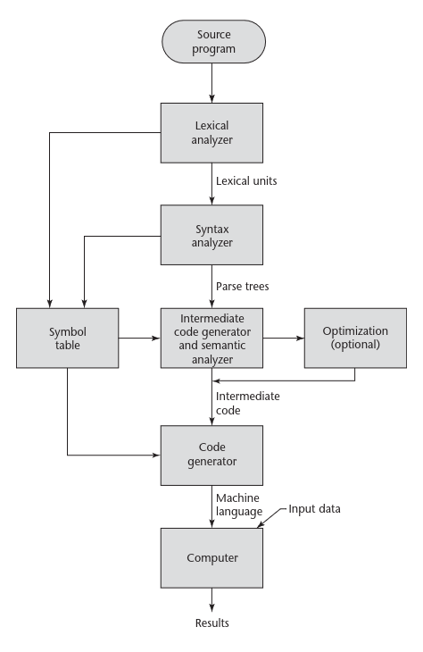

    
    
Universidade Federal do Rio Grande do Norte

    
Departamento de Informática e Matemática Aplicada

    
DIM0548 – Engenharia de Linguagens

    <h1 style="font-family: 'Times New Roman', serif;">DOCUMENTAÇÃO</h1>
    <h2 style="font-family: 'Times New Roman', serif;">KOJITO</h2>

    
EXPEDITO HEBERT FIRMINO DA ROCHA

    
FRANCISCO GABRIEL COSTA BESSA

    
JOSE CARLOS DA SILVA NASCIMENTO

    
PEDRO VINÍCIUS BARBOSA PEREIRA

    
SABRINA DA SILVA BARBOSA VENCESLAU

    
Natal - RN

    
2026

    

        
SUMÁRIO

    

    

        

            
                <a href="#APRESENTACAO" style="text-decoration: none; color: black;">
                    <strong>1. APRESENTAÇÃO DA LINGUAGEM PROPOSTA</strong>
                </a>
            
            
            <strong>10</strong>
        

        

            
                <a href="#DESIGN" style="text-decoration: none; color: black;">
                    <strong>2. DESIGN DA IMPLEMENTAÇÃO</strong>
                </a>
            
            
            <strong>15</strong>
        

        

            
                <a href="#Transformação" style="text-decoration: none; color: black;">
                    2.1 Transformação do código-fonte em unidades léxicas
                </a>
            
            
            18
        

        

            
                <a href="#Representação" style="text-decoration: none; color: black;">
                    2.2 Representação de símbolos, tabela de símbolos e funções associadas
                </a>
            
            
            18
        

        

            
                <a href="#Tratamento" style="text-decoration: none; color: black;">
                    2.3 Tratamento de estruturas condicionais e de repetição
                </a>
            
            
            18
        

        

            
                <a href="#Tratamento de subprogramas" style="text-decoration: none; color: black;">
                    2.4 Tratamento de subprogramas
                </a>
            
            
            18
        

        

            
                <a href="#Verificações realizadas" style="text-decoration: none; color: black;">
                    2.5 Verificações realizadas (tipos, faixas, declaração em duplicidade, etc)
                </a>
            
            
            18
        

        

            
                <a href="#Tipos" style="text-decoration: none; color: black;">
                    2.5.1 Tipos
                </a>
            
            
            20
        

        

            
                <a href="#Faixas" style="text-decoration: none; color: black;">
                    2.5.2 Faixas
                </a>
            
            
            20
        

        

            
                <a href="#INSTRUÇÕES" style="text-decoration: none; color: black;">
                    <strong>3. INSTRUÇÕES DE USO DO COMPILADOR</strong>
                </a>
            
            
            <strong>25</strong>
        

        

            
                <a href="#CONSIDERAÇÕES" style="text-decoration: none; color: black;">
                    <strong>4. CONSIDERAÇÕES FINAIS</strong>
                </a>
            
            
            <strong>40</strong>
        

        

            
                <a href="#REFERÊNCIAS" style="text-decoration: none; color: black;">
                    <strong>REFERÊNCIAS</strong>
                </a>
            
            
            <strong>45</strong>
        

    

    <h1 id="APRESENTACAO" style="font-size: 12pt; font-family: 'Times New Roman', serif; margin-bottom: 24px; text-transform: uppercase;"> 1. APRESENTAÇÃO DA LINGUAGEM PROPOSTA </h1>
    

        O presente trabalho tem como objetivo apresentar a linguagem de programação Kojito, que está sendo desenvolvida como parte dos requisitos para concluir a disciplina de Engenharia de Linguagem do Departamento de Informática e Matemática Aplicada/DIMAP na Universidade Federal do Rio Grande do Norte/UFRN.
    

    

        Para tanto, a Kojito consiste em ser uma linguagem de programação com paradigma imperativo que se fundamenta na arquitetura de von Neumann e adota um estilo de programação com uso de variáveis, instruções de atribuição e na forma iterativa de repetição. De modo geral, caracteriza-se pela forma de comandos detalhados para a realização de uma determinada tarefa.
    

    

        Também é importante salientar que o domínio de aplicação da nossa linguagem é de uma Linguagem educacional, com foco no ensino de aspectos relacionados à segurança de memória, bem como aspectos que vêm do funcional. 
	    Nossa ideia se aplica principalmente a alunos que já tiveram algum contato com programação, especialmente quem já teve algum contato com programação no nível do que é visto, por exemplo, na disciplina de Linguagem de Programação 1, ofertada pelo Instituto Metrópole Digital/IMD no curso do Bacharelado em Tecnlogia da Informação BTI.
	    Dessa forma, o objetivo é dar um suporte no aprendizado sobre coisas básicas, porém importantes para um bom uso dos recursos computacionais, ressaltando os trade offs relacionados ao uso de memória e os custos ao utilizar recursos de alto nível.
    

    

        Salienta-se ainda que a Kojito está no âmbito de software básico educacional e, baseando-se no livro concepts of programming Languages edição 11 de Robert W. Sebesta, os critérios que têm maior relevância para a nossa linguagem são, principalmente, a legibilidade e a confiabilidade. 
        Destacando que algumas características presentes em capacidade de escrita, como o tipo de dados, ortogonalidade e suporte à abstrações, por exemplo, têm um papel fundamental para a construção da nossa linguagem, pois essas características somadas a checagem de tipo, tratamento de exceção e restricted aliasing, fornecem uma estrutura robusta para ela. 
        Todavia, apesar de não ser uma linguagem com foco em alta performance, algumas características relacionadas ao custo se fazem necessárias para se ter um equilíbrio entre o uso de recursos disponíveis (baixo nível) e a contribuição ao aprendizado do usuário (alto nível). Entretanto, caso necessário, essas características de custo serão as primeiras a serem penalizadas em prol de uma maior confiabilidade e/ou legibilidade.
    

    

        Por fim, cabe destacar que para desenvolver a linguagem de programação Kojito, não será necessário criar uma nova camada de abstração, sendo possível usufruir das características do paradigma imperativo e ainda deixá-la num nível intermediário entre alto nível e baixo nível.
	    Portanto, nossa ideia consiste em uma linguagem mais segura, tendo foco em legibilidade e confiabilidade, sacrificando aspectos, principalmente, relacionados ao custo se preciso for.
    

    <h1 id="DESIGN" style="font-size: 12pt; font-family: 'Times New Roman', serif; margin-bottom: 24px; text-transform: uppercase;"> 2 DESIGN DA IMPLEMENTAÇÃO </h1>
    

        Para a concretização de nossa ideia seguimos as instruções norteadoras dadas pelo professor Dr. Umberto Souza da Costa, bem como baseamo-nos no fluxo presente no livro do Sebesta - Concepts of programming Languages edição 11, que apresenta o processo de compilação. Dessa forma, iniciamos a nossa linguagem definindo o que seria um programa nela em que, a partir disso, construimos os nossos tokens para gerar a nossa tabela de símbolos, para então gerar as estruturas sintáticas da mesma e, por fim, poder realizar as relações de sentindo entre as estruturas sintáticas, bem como as relações de tipos, conforme imagem abaixo:
    

    

        
<strong>Figura 1</strong> – Processo de compilação

        
        
Fonte: Robert W. Sebesta (2015).

    

    

        Com isso, entraremos em detalhes para cada uma dessas etapas, de modo que traremos exemplos de como ocorre em nossa linguagem, apresentando quais foram as estratégias que utilizamos para a realização desses passos.
    

    

        <h3> 2.1 Transformação do código-fonte em unidades léxicas</h3>
    

    

        Para que um código em linguagem imperativa seja lido e executado é importante lembrar que ele passa por 3 grandes etapas que são popularmente conhecidas por: Analisador lexico; Analisador Sintático e Analisador Semântico, além de passar por outros processos menores como podemos ver na figura 1.
    

    

        Isso posto, de acordo com Andrew W. Appel (1998), o analisador léxico recebe um fluxo de caracteres e produz um fluxo de nomes, palavras-chaves e sinais de pontuação (lexemas), descartando espaços em branco e comentários entre os tokens. Porém, cabe destacar que a depender do design da linguagem, pode acontecer de espaços em branco serem na verdade tokens, não podendo descartá-los. 
        Complementar a isso, de acordo com Sebesta (2015), um analisador léxico é essencialmente um “pattern matcher”, ou seja, é algo que realiza casamento de padrões. 
    
    
        Dessa forma, para uma dada entrada são realizadas comparações com os símbolos existentes na linguagem, de modo que a partir dessas comparações os tokens serão associados ao conjunto de caracteres detectado.
	    Dito isso, as principais tarefas de um analisador léxico são:
    

        <ul style="padding-left: 50px; margin-bottom: 12px;">
            <li style="margin-bottom: 6px;">Ler (escanear) todos os caracteres de um dado arquivo (fluxo de entrada);</li>
            <li style="margin-bottom: 6px;">Identificar lexemas (agrupamento de símbolos conhecidos) a partir dos caracteres lidos;</li>
            <li style="margin-bottom: 6px;">Gerar tokens (unidade gramatical de uma linguagem) a partir dos lexemas;</li>
            <li style="margin-bottom: 6px;">Ignorar o que é considerado desnecessário;</li>
            <li style="margin-bottom: 6px;">Gerar a tabela de símbolos para o fluxo de entrada dado;</li>
            <li style="margin-bottom: 6px;">Detectar caracteres não reconhecidos e comunicar erro de símbolo que não faz parte do conjunto de símbolos aceitos pela linguagem.</li>
        </ul>
    

    

        Assim, realizadas essas tarefas e não havendo nenhum erro lexical, será possível avançar para a etapa de análise sintática, da qual depende essencialmente do que o analisador léxico produz.
    
